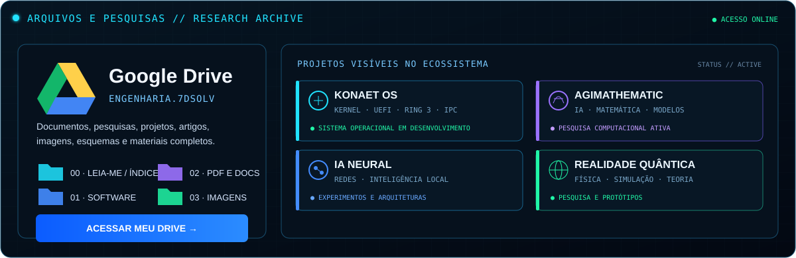
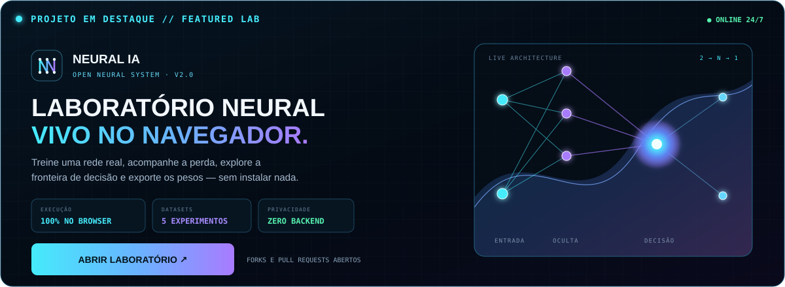
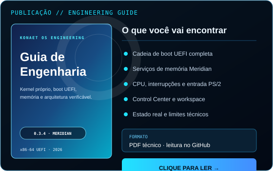
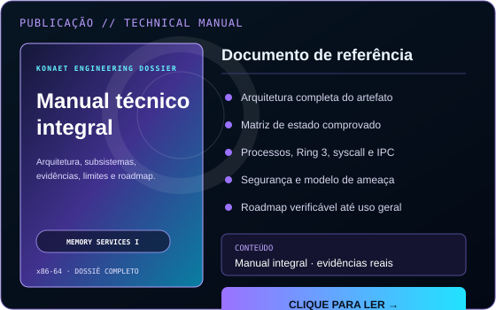
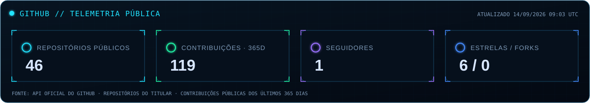
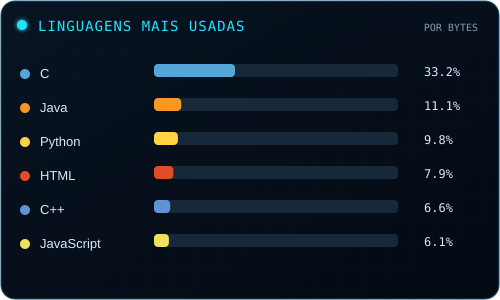
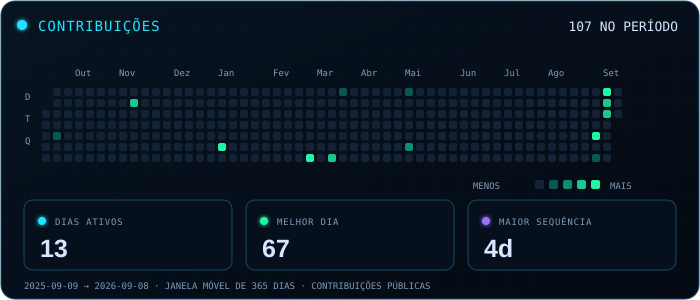
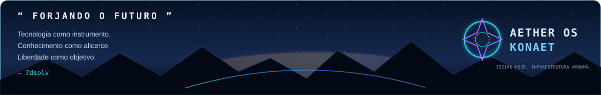

<div align="center">



<br />

<a href="#sobre-mim"></a>
<a href="#sistemas-em-desenvolvimento"></a>
<a href="#arquivos-pesquisas-e-publicações"></a>
<a href="#tecnologias"></a>
<a href="#atividade"></a>
<a href="#contato"></a>

</div>

<br />

<table>
<tr>
<td width="30%" align="center" valign="top">


### Adilson Oliveira

`@7dsolv`


Brasil · São Paulo  
Software Engineering  
Systems Research  
Konaet Cover · Sistemas · IA

<a href="https://github.com/7dsolv"></a>
<a href="https://www.linkedin.com/in/adilson-oliveira-779490283"></a>
<a href="https://www.instagram.com/7dsolv"></a>

</td>
<td width="70%" valign="top">



### Estado atual

```text
FOCO            ATIVO
ESTUDOS         ATIVO
KONAET COVER    EM DESENVOLVIMENTO
IA LOCAL        ATIVO
PESQUISA        ATIVO
INFRAESTRUTURA  EM EVOLUÇÃO
```

</td>
</tr>
</table>

## Sobre mim

Construo sistemas a partir dos primeiros princípios, unindo engenharia de software, arquitetura de sistemas, inteligência artificial e pesquisa científica. Meu projeto principal é o **Konaet Cover**: uma plataforma experimental de proteção de dispositivos com aplicativo Android, API, simulação de risco, auditoria causal e ancoragem verificável.

> “Grandes sistemas não nascem prontos, mas da soma de pequenas verdades diárias.”

## Sistemas em desenvolvimento

<a href="https://github.com/7dsolv/konaet-cover">
  
</a>

<div align="center">

### KONAET · projeto principal

[](https://github.com/7dsolv/konaet-cover)
[](https://github.com/7dsolv/konaet-cover/issues)
[](https://github.com/7dsolv?tab=repositories)

[](https://github.com/7dsolv/konaet-cover/actions/workflows/ci.yml)
[](https://github.com/7dsolv/konaet-cover/blob/main/LICENSE)
[](https://github.com/7dsolv/konaet-cover/issues)
[](https://github.com/7dsolv/konaet-cover/discussions)

Engenharia de sistemas, computação independente e inteligência local construídas de forma verificável e colaborativa.

</div>

<table>
<tr>
<td width="50%" valign="top">

### [`KONAET COVER`](https://github.com/7dsolv/konaet-cover)

Plataforma experimental com Android, API NestJS, motor de risco FastAPI, auditoria causal e checkpoints em Solidity.

`Kotlin` `TypeScript` `Python` `Solidity` `PostgreSQL`

[](https://github.com/7dsolv/konaet-cover)

</td>
<td width="50%" valign="top">

### [`AGIMathematic`](https://github.com/7dsolv/AGIMatematic)

Explorações de inteligência artificial, raciocínio matemático e arquiteturas orientadas à pesquisa computacional.

`IA` `Matemática` `Modelos` `Pesquisa`

[](https://github.com/7dsolv/AGIMatematic)

</td>
</tr>
<tr>
<td width="50%" valign="top">

### [`IA Neural`](https://7dsolv.github.io/IA_Neural/)

Laboratório open source para treinar redes neurais no navegador, visualizar decisões e estudar backpropagation com testes reproduzíveis.

`JavaScript` `Python` `Neural Networks` `GitHub Pages`

[](https://7dsolv.github.io/IA_Neural/)
[](https://github.com/7dsolv/IA_Neural)

</td>
<td width="50%" valign="top">

### [`Realidade Quântica`](https://github.com/7dsolv/RealidadeQuantica)

Pesquisa, ideias e protótipos na interseção entre computação, matemática e física quântica.

`Física` `Simulação` `Teoria` `Pesquisa`

[](https://github.com/7dsolv/RealidadeQuantica)

</td>
</tr>
</table>

## Arquivos, pesquisas e publicações

<a href="https://drive.google.com/drive/folders/13K20ctDlS_xR-s3Zp3Yle_kPhxTTYf_v?hl=pt-br">
  
</a>

<div align="center">

[](https://drive.google.com/drive/folders/13K20ctDlS_xR-s3Zp3Yle_kPhxTTYf_v?hl=pt-br)

</div>

### Neural IA — laboratório aberto para a comunidade

<a href="https://7dsolv.github.io/IA_Neural/">
  
</a>

<div align="center">

[](https://7dsolv.github.io/IA_Neural/)
[](https://github.com/7dsolv/IA_Neural)
[](https://github.com/7dsolv/IA_Neural/issues/new/choose)
[](https://github.com/7dsolv/IA_Neural/fork)

</div>

Treinamento e inferência acontecem localmente no navegador. O projeto inclui cinco datasets, visualização da fronteira de decisão, grafo da arquitetura, exportação dos pesos, motor equivalente em Python, testes, CI, CodeQL e instruções próprias para o GitHub Copilot.

### Leia meus PDFs sem sair do ecossistema

As capas e os resumos ficam visíveis aqui no perfil. Clique em uma publicação para abrir o leitor de PDF do GitHub em tela cheia.

<table>
<tr>
<td width="50%" align="center" valign="top">

<a href="./publications/konaet-os-engineering-guide.pdf">
  
</a>

**Konaet OS — Guia de Engenharia**  
Release 0.3.4 · x86-64 UEFI

[](./publications/konaet-os-engineering-guide.pdf)
[](https://raw.githubusercontent.com/7dsolv/7dsolv/main/publications/konaet-os-engineering-guide.pdf)

</td>
<td width="50%" align="center" valign="top">

<a href="./publications/konaet-os-complete-technical-manual.pdf">
  
</a>

**Konaet OS — Manual técnico integral**  
Arquitetura, evidências, limites e roadmap

[](./publications/konaet-os-complete-technical-manual.pdf)
[](https://raw.githubusercontent.com/7dsolv/7dsolv/main/publications/konaet-os-complete-technical-manual.pdf)

</td>
</tr>
</table>

> **Research Archive:** documentos, especificações, experimentos e publicações técnicas organizados em um só lugar. Novos PDFs podem ser adicionados copiando o modelo das duas publicações acima.

## Tecnologias

<div align="center">


</div>

## Atividade

<!-- Estes SVGs são atualizados automaticamente por .github/workflows/update-profile.yml. -->



<table>
<tr>
<td width="46%" valign="top">

</td>
<td width="54%" valign="top">

</td>
</tr>
</table>

<div align="center">

[](https://github.com/7dsolv/7dsolv/actions/workflows/update-profile.yml)

</div>

## Princípios

```text
compreender  →  estruturar  →  construir  →  verificar  →  evoluir
```

- Tecnologia como instrumento.
- Conhecimento como alicerce.
- Verificação por projeto, não por confiança.
- Infraestrutura independente como objetivo.

## Contato

Quer conversar sobre sistemas operacionais, IA, infraestrutura independente ou pesquisa computacional?

<div align="center">

[](https://github.com/7dsolv)
[](https://www.linkedin.com/in/adilson-oliveira-779490283)
[](https://www.instagram.com/7dsolv)

<br />



<sub>© 2026 7dsolv — Adilson Oliveira · Sistemas de verdade para um amanhã real.</sub>

</div>
